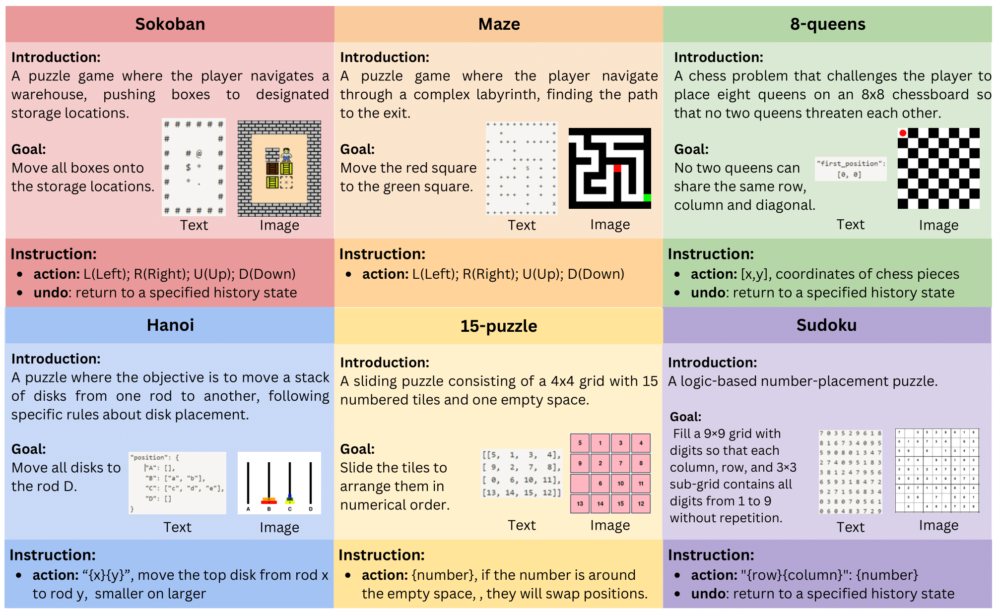

# ING-VP Bench

<p align="center">
  
</p>

This repository includes the evaluation code for the corresponding paper"[ING-VP: MLLMs cannot Play Easy Vision-based Games Yet](https://arxiv.org/abs/2410.06555)"

## Overview

<!-- ING-VP benchmark is a new interactive game-based vision planning benchmark designed to measure the multi-step reasoning and spatial imagination capabilities of MLLMs. The benchmark encompasses 6 distinct settings, 6 games, and 50 levels per game. -->
We propose **ING-VP** benchmark, a new interactive game-based vision planning benchmark designed to measure the multi-step reasoning and spatial imagination capabilities of Multimodal Large Language Models (MLLMs). In this work, ING-VP features 6 distinct games, encompassing 300 levels, each with 6 unique configurations. In our settings, a single model engages in over 60,000 rounds of interaction. The benchmark framework allows for multiple comparison settings, including image-only vs. text-only inputs, single-step vs. multi-step reasoning, and with-history vs. without-history conditions, offering valuable insights into the model’s capabilities. With our ING-VP, we reveal that current MLLMs generally lack spatial imagination and multi-step planning abilities, and offer a new perspective on the capability requirements for MLLMs. 

<p align="center">
  
</p>

## How to use?

### Setup

To get started with the ING-VP benchmark, first install the necessary dependencies by executing the following command:

```bash
git clone https://github.com/Thisisus7/ING-VP.git
pip install -r requirements.txt
```

### Inference

Four settings of **multi-step** and **one-step** at once:

```bash
bash run.sh
```

### Evaluation

All outputs will be automatically computed and saved. The final results can be found in the `outputs/multi_step/final`,  `outputs/one_step/final` and `outputs/summary` folders.

You can also evaluate the model's performance manually by executing the following command:

```python
python ./src/summary.py
```

## How to add your model?

- Add the model class in `src/model.py`.
- Import the model in `src/multi_step/infer.py` and `src/one_step/infer.py`.
- Update the `MODEL` variable in `run.sh` to enable selection of different MLLMs for evaluation.

## Citation

```bibtex
@misc{zhang2024ingvpmllmsplayeasy,
      title={ING-VP: MLLMs cannot Play Easy Vision-based Games Yet}, 
      author={Haoran Zhang and Hangyu Guo and Shuyue Guo and Meng Cao and Wenhao Huang and Jiaheng Liu and Ge Zhang},
      year={2024},
      eprint={2410.06555},
      archivePrefix={arXiv},
      primaryClass={cs.CL},
      url={https://arxiv.org/abs/2410.06555}, 
}
```
